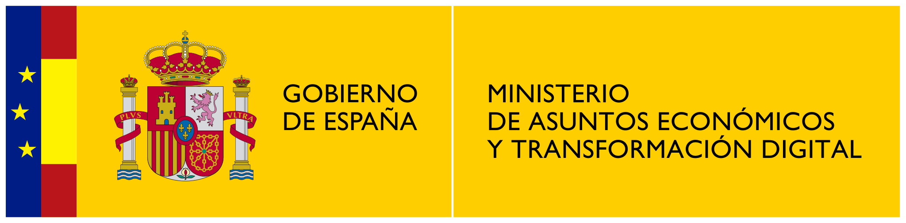

# Paraphrasing project
## Determining frequent paraphrases for arbitrary expressions

A TSI-100905-2019-4 project, co-financed by Ministry of Economic Affairs and Digital Transformation from the Government of Spain.



Industrial research project in the field of Natural Language Processing. November 2019 - December 2021 (26 months).

More info: https://parafrasis.prompsit.com/

# The problem

Paraphrasing is the linguistic mechanism that humans use to express one same message with different structures and words.

Humans are able to understand easily that different sentences may convey the same message. However, for machines this is a complicated task and, in fact, one of the biggest limitations in human-machine communication. 

A lot of variability is introduced in linguistic communication through paraphrasing. Managing this variability automatically is really complex and requires a big effort when intereacting with machines. Indeed, we spend a lot of time  rewriting over and over our queries in the text field of search engines, and we usually narrow down our language when we use voice assistants. This complexity also affects many work fields, such as, automatic translation, interaction with chat bots, document classification, etc.

A great deal of effort is invested in order to control this limitation and endeavour to make systems answer to any given input, working on the resilience of systems to language variability. This is achieved through dictionaries, rules, statistic technologies, or neuronal learning. These approaches have to deal with some issues, including context-specific ones.

Instead of making a system that is resistant to language flexibility, our approach focuses on learning from language variability. By working on paraphrasing, we search for efficient mechanisms to generate said flexibility, ensuring we can recognise and then use it in specific applications.

# Our approach

* Variability in contrast with the rigidity of previous solutions
* From a general approach to more specific solutions
* Multilingual — English, Spanish and Portuguese
* Big Data — high quality data, diverse and numerous
* An heterogeneous solution in three phases: artificial intelligence, statistical techniques and language modelling

# Phases

1. Acquisition and text segmentation: 
    * Detection of phrases likely to be paraphrased
    * Gathering and cleaning of textual resources
    * Implementation of a method of text segmentation in meaningful units
3. Paraphrase generation with diverse techniques
    * Statistic and neuronal automatic translation (advanced encoder-decoder models, transformer, Bert)
    * Synonyms dictionaries and lemmatizers
    * Context vectors, word, phrase and sentence embeddings
    * Language models
    * Further research into other applicable technologies
5. Classification and validation of paraphrases
    * Automatic classification: neural networks, support vector machines, random forest, etc.
    * Human validation

# Results 

1. Corpora
Corpora sized 10 million sentences each and containing high-quality monolingual content have been compiled from online and offline sources
   * Spanish: https://parafrasis.prompsit.com/downloads/corpora/spanish.xz
   * English: https://parafrasis.prompsit.com/downloads/corpora/english.xz
   * Portuguese: https://parafrasis.prompsit.com/downloads/corpora/portuguese.xz
2. Models: Paraphrase classification models for Spanish, Portuguese and English publised on HugginFace: https://huggingface.co/Prompsit
3. Software: Human validation of paraphrases was developed and added as a task in the web application KEOPS as part of this project: https://github.com/paracrawl/keops/tree/paraphrasing-beta 
4. Papers
   * EAMT 2020 paper using the tools to get to high-quality monolingual corpora applied to corpora cleaning and its impact in machine translation: 


> Gema Ramírez-Sánchez, Jaume Zaragoza-Bernabeu, Marta Bañón and Sergio Ortiz Rojas \
> "[Bifixer and Bicleaner: two open-source tools to clean your parallel data.](https://eamt2020.inesc-id.pt/proceedings-eamt2020.pdf#page=311)",\
>in *Proceedings of the 22nd Annual Conference of the European Association for Machine Translation*.\
>Lisboa, Portugal: European Association for Machine Translation, November 2020

```latex
@InProceedings{prompsit:2020:EAMT,
  author    = {Gema Ram\'{i}rez-S\'{a}nchez and Jaume Zaragoza-Bernabeu and Marta Ba{\~n}\'{o}n and Sergio Ortiz-Rojas},
  title     = {Bifixer and Bicleaner: two open-source tools to clean your parallel data.},
  booktitle = {Proceedings of the 22nd Annual Conference of the European Association for Machine Translation},
  pages	    = {291--298},
  isbn      = {978-989-33-0589-8},
  year	    = {2020},
  month     = {November},
  address   = {Lisboa, Portugal},
  publisher = {European Association for Machine Translation}
}
```

# Acknowledgments

 This is a TSI-100905-2019-4 project, co-financed by the Ministry of Economic Affairs and Digital Transformation from the Government of Spain. 
